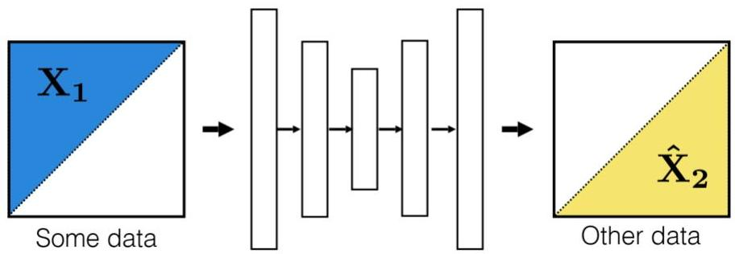
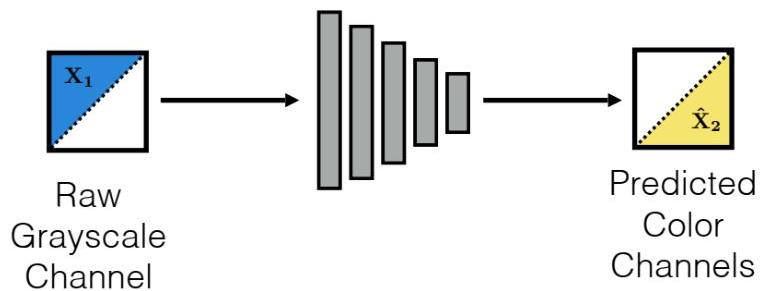

# Self-supervision

In the absence of annotations (unsupervised settings), self-supervision can be pursued to emulate predictive tasks

- masking parts of data for reconstruction (e.g. word masking is at the basis of LLMs such as ChatGPT)

A supervised alternative for coloring tasks:

TÉCNICO+
FORMAÇÃO AVANÇADA