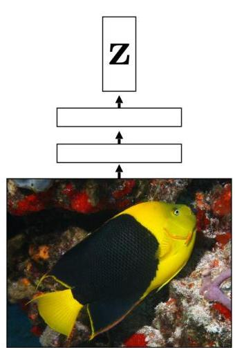
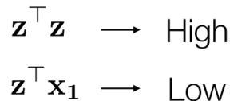
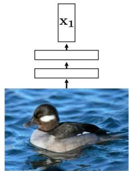
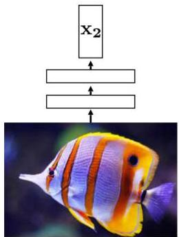

# Contrastive learning

- Learn embeddings by comparing inputs rather than solely relying on reconstruction or prediction
- Form pairs of inputs and train models by
- pulling representations of similar (positive) examples closer together
- pushing representations of dissimilar (negative) examples farther

TÉCNICO+

FORMAÇÃO AVANÇADA

by Isola, Freeman, Torralba