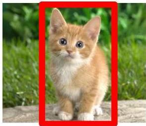
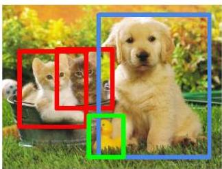
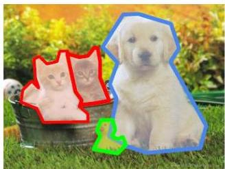

# Computer vision tasks

- Computer vision has been a focal area of interest for ML
- Illustrative tasks: localization, object detection, instance segmentation

Classification
CAT

Classification + Localization
CAT

Object Detection
CAT, DOG, DUCK

Instance Segmentation
CAT, DOG, DUCK

TÉCNICO+

FORMAÇÃO AVANÇADA

Picture from: Li, Karpathy, Johnson – Understanding and Visualizing CNNs