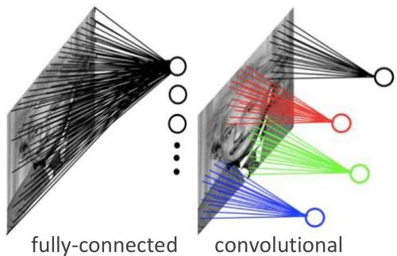
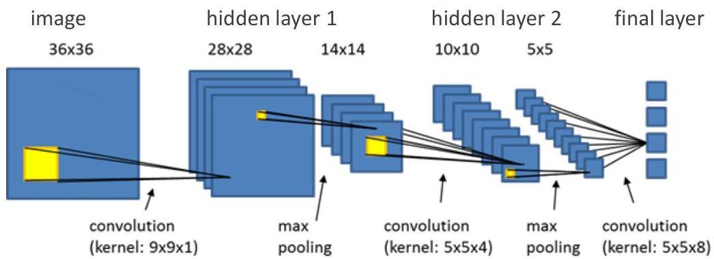

# Convolutional NNs

Hidden units are connected to local receptive fields (spatial dependencies)

- much lower number of parameters than fully-connected layers!
- inspired by neurophysiological experiments [Hubel &amp; Wiesel 1962]
- convolution and pooling operations form the basis of CNNs

TÉCNICO+

FORMAÇÃO AVANÇADA

by eCognition