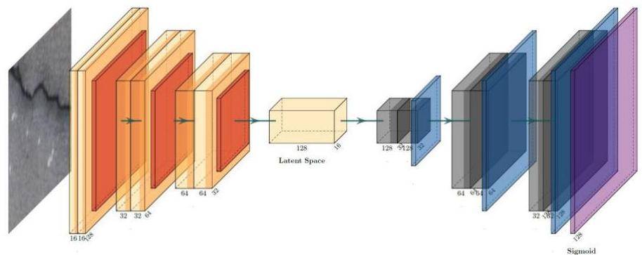
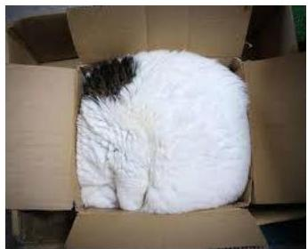
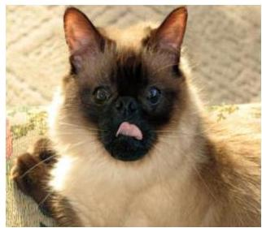

# Convolutional autoencoders

Convolutions can be applied in autoencoder architectures to create image representations

- embedding size and layering should be sufficiently expressive to handle vision challenges...

TÉCNICO+

FORMAÇÃO AVANÇADA