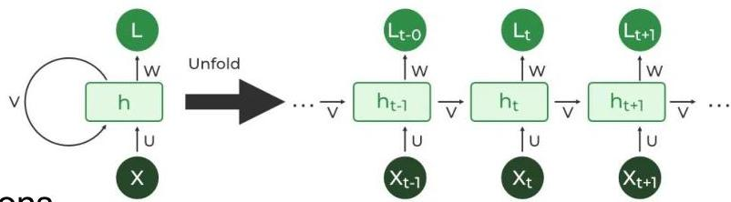

# Recurrent NNs

- How to learn from time series data or video data?
- CNNs can be used for these ends: 1D CNNs for time series, 3D CNNs for video data
- however, the locality of convolution operations often neglect long-term temporal dependencies
- Recurrent NNs offer a possible way out
- recurrent connections: a single unit to process features from one variable along time
- memory of the previous inputs stored in the internal state to capture temporal associations
- Long Short-Term Memory (LSTM) networks are a RNN variant with enhanced internal state
- well-prepared to model long-term temporal dependencies
- Trade-off: RNNs are more sensitive to the vanishing gradient problem than CNNs, hence less stable

TÉCNICO+
FORMAÇÃO AVANÇADA