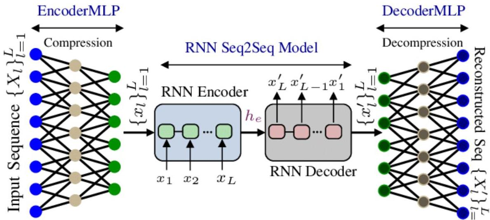

# Recurrent autoencoders

... and, yes, recurrent layering can be also considered for autoencoders
- find numeric representations of (multivariate) time series

Hybrid layering: combines different types of transformations

TÉCNICO+
FORMAÇÃO AVANÇADA