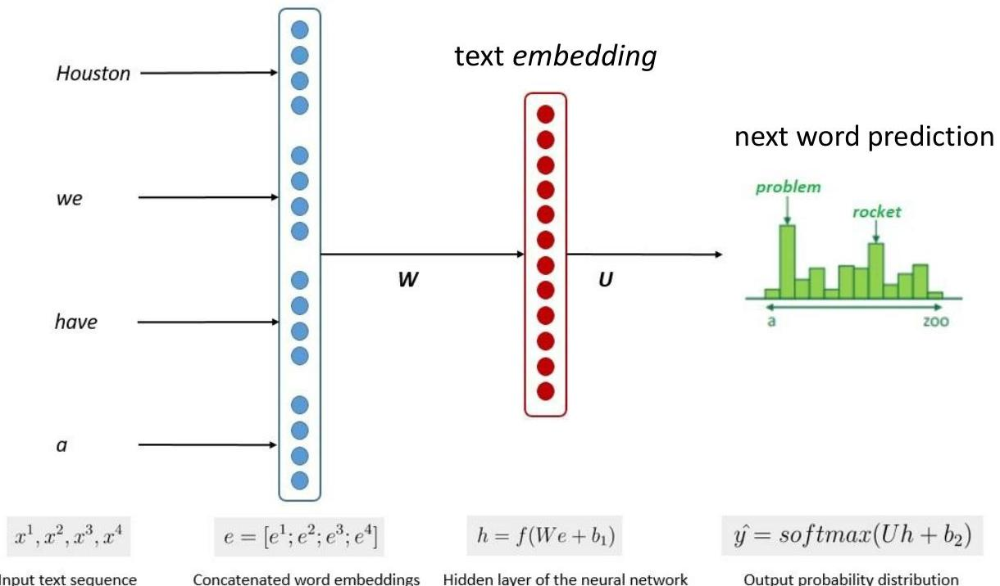

# Large Language Models

Central principles:
- word embeddings
- positional embeddings
- self-supervision
- self-attention
- pre-training + fine-tuning

TÉCNICO+
FORMAÇÃO AVANÇADA
https://www.baeldung.com/cs/large-language-models
49