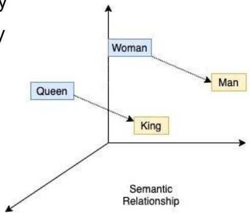
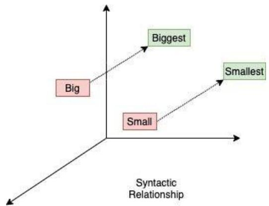

# LLMs: text encodings

Apply a dedicated NN to map words into numeric vectors capturing:

- semantic similarity
- syntactic similarity

Create a complementary numeric vector per word with its positional encoding

- aims at capturing relative positions of a word in text (e.g. "Mary loves John" ≈ "John is loved by Mary")

TÉCNICO+

FORMAÇÃO AVANÇADA