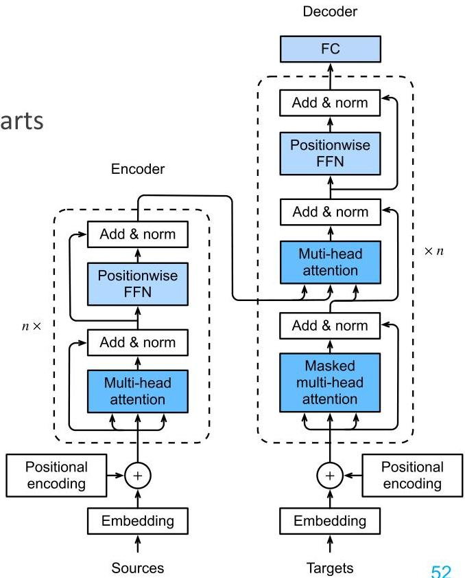

# LLMs: attention-based architecture

Architectural elements of an LLM

- attention: enhance parts of the signal while diminishing other parts
- self-attention: weighting the relevance of terms/tokens (from their embedding) to predict the masked term
- central component: attention-based transformer (right)
- encoder layer encodes which parts of the input are relevant to each other
- decoder takes all encodings to generate an output sequence
- encoder-only (whole text modeling) and decoder-only (word prediction) variants are also common
- an LLM is a stacking of multiple transformer components with skip connections for multi-domain learning capacity

TÉCNICO+

FORMAÇÃO AVANÇADA