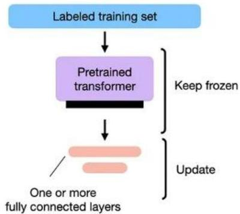
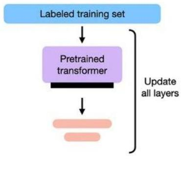

# LLMs: pre-training and fine-tuning

- LLM are commonly **pre-trained** on different datasets and different tasks
- going beyond single corpus and word prediction (e.g., semantic similarity between paired text)
- the parameters of the first layers (i.e. transformers) are updated for the alternating tasks

- Pre-training followed by **fine tuning**
- to orient the LLM for specific tasks and/or more closely related data
- two major strategies
- retrain all network (heavy)
- retrain last layers only (preserve embeddings/intermediate signals)

Fine-tuning - Updating The Output Layers

Fine-tuning - Updating All Layers

TÉCNICO+

FORMAÇÃO AVANÇADA

https://www.baeldung.com/cs/large-language-models
53