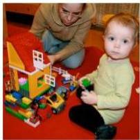
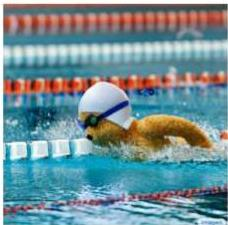
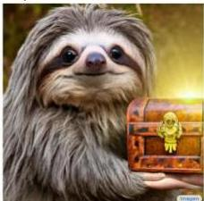

# Multimodal Representations

Multimodal LLMs are well-known class
- embeddings for coupled vision, audio, and text observations
- captioning

http://cs.stanford.edu/people/karpathy/deepimagesent

"two young girls are playing with lego toy."

"boy is doing backflip on wakeboard."

"construction worker in orange safety vest is working on road."

"man in black shirt is playing guitar."

- text-to-image generation
- "teddy bear swimming at the Olympics"
- "cute corgi lives inside sushi house"
- "sloth holding treasure with bright golden light"

by Sahara et al. 2022

57