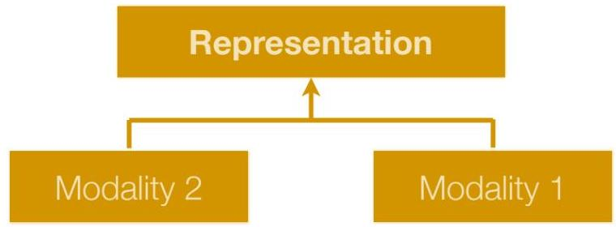
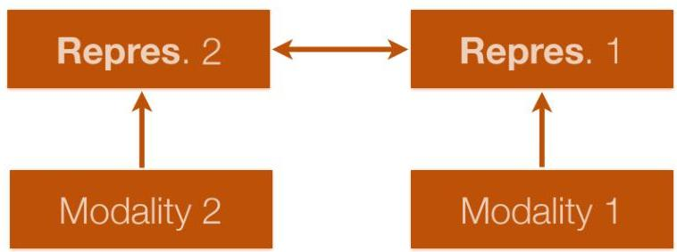

# Multimodal representations

- Different strategies to learn multimodal representations, including:

- joint representation (simplest version)
- modality concatenation (early fusion)
- unsupervised or supervised
- similarity-based methods (e.g., cosine)

- coordinated representations
- constraints on structure (e.g., orthogonality, sparseness)

TÉCNICO+
FORMAÇÃO AVANÇADA