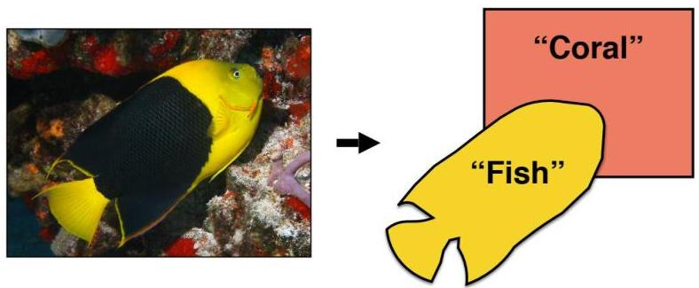

# Good representations

What makes a good representation? Good representations are:

1. compact (minimal)
2. explanatory (sufficient)
3. disentangled (independent factors)
4. interpretable
5. informative (make subsequent problem solving easier)

by Isola, Freeman, Torralba

TÉCNICO+
FORMAÇÃO AVANÇADA