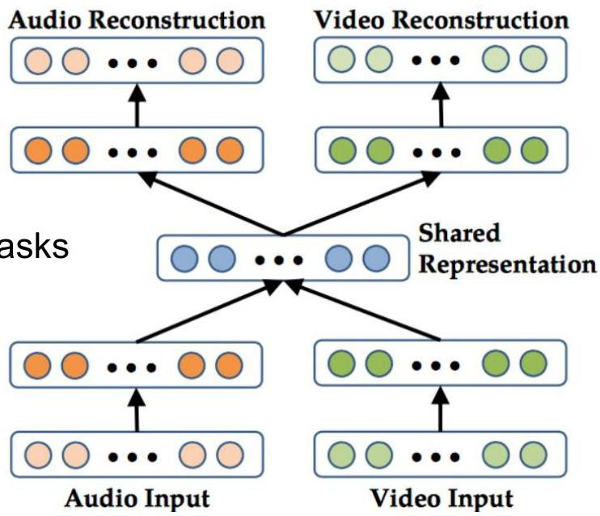

# Joint representations

- Shared representations (joint embedding) capture cross-modal synergies
- efficiency: lower dimensionality than the sum of individual representations
- expressivity: higher efficacy for downstream tasks
- Each modality can be pre-trained (using modality-specific autoencoders) before adding the shared layer

TÉCNICO+
FORMAÇÃO AVANÇADA