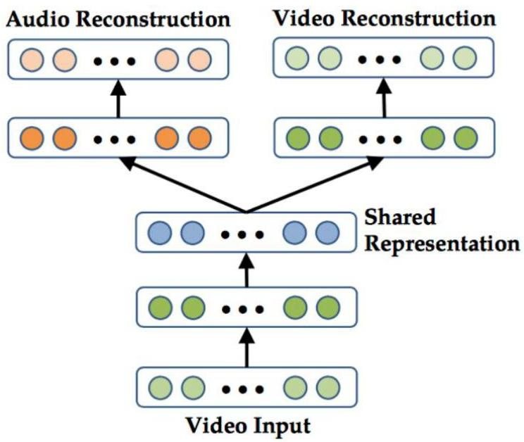

# Joint representations

- At training time:
- all modalities can be inputted
- a subset of modalities can be removed for some data instances
- regarded as a form of regularization (dropout) that helps the training
- At testing time: if only some modalities are available, the remaining are generated

TÉCNICO+
FORMAÇÃO AVANÇADA