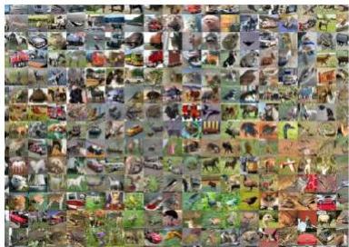
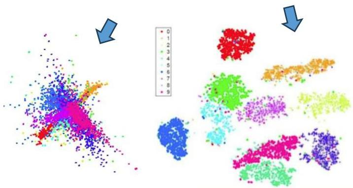

# Good representations

These properties can be easily tested

- smoothness: reconstruction capacity
- given $\mathbf{z} = g(\mathbf{x})$, recover $\hat{\mathbf{x}} = g1(\mathbf{z})$ and assess $\|\hat{\mathbf{x}} - \mathbf{x}\|$
- invariance: inject non-relevant changes, $\mathbf{x}'$, and assess $\|\mathbf{z}' - \mathbf{z}\|$
- disentanglement: low dependencies in $Z$ (recall descriptive statistics from previous class)
- sparsity: average #zeros per representation, $\{z_1, \ldots, z_n\}$
- learning utility: predictive scores (accuracy, F1, errors...) and descriptive scores (clustering quality...)
- compactness: #features
- ...

TÉCNICO+

FORMAÇÃO AVANÇADA