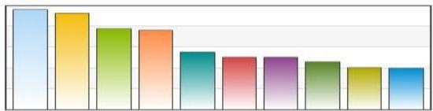

# Feature ranking

- Weighting each individual feature according to objective criteria (e.g. information gain)

- Sort and select top-ranked features: a) threshold, b) $k$-top, or c) percentile
- Disadvantages
- hard to determine threshold or $k$
- unable to consider correlation between features
- Advantages
- efficient $O(m)$ no need to test combination of features (subset optimality)

TÉCNICO+ FORMÁCÃO AVANÇADA