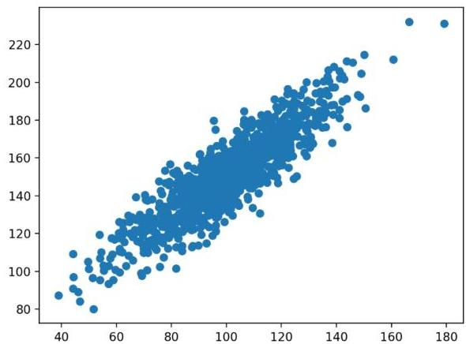

# Information measures in regression

- correlation for numeric input variables:
- Pearson and Spearman (see previous lectures)
- $F$-statistic (higher the better) and accompanying $p$-value

- mutual information or ANOVA for categorical input variables

- want to abstract the type of input variables? use f_regression from sklearn

TÉCNICO+
FORMAÇÃO AVANÇADA