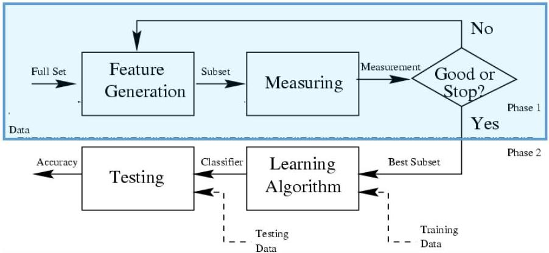
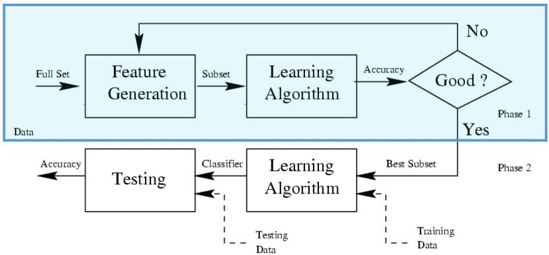

# Feature selection: filter vs. wrapper

## Filter model
- independent from the learning algorithm
- efficient and no learning biases
- rely on general characteristics of data

## Wrapper model
- evaluated on a given descriptor/predictor
- descriptive utility or predictive accuracy as a goodness measure
- better yet dependent on the learning approach
- more computationally expensive

TÉCNICO+

FORMAÇÃO AVANÇADA