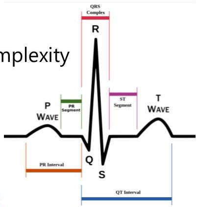
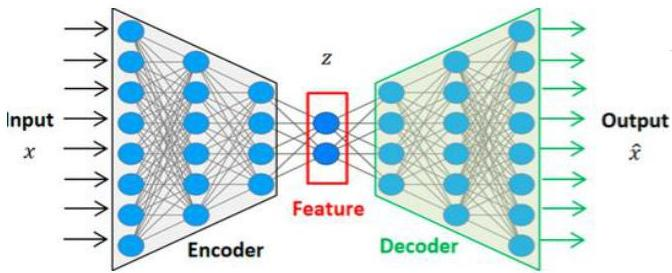

# Feature extraction

- Feature extraction used to
- extract relevant features from complex data to handle structural complexity
- extract domain-specific features of interest
- e.g. PQRST statistics from ECG signal
- extract domain-independent statistics of interest
- e.g. spectral statistics from time series and images
- learn latent features using neural networks (data representation)

- learn transformations that explain simple multivariate data with reduced dimensionality

TÉCNICO+
FORMAÇÃO AVANÇADA