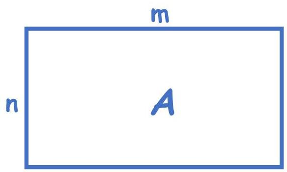
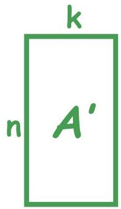

# Dimensionality reduction

- Map data with $m$ variables into $k$ variables (such that $k &lt; m$) without significant loss

- Residual variation: information in A not retained in A'
- Trade-off: dimensionality $(k)$ and interpretability versus information loss

TÉCNICO+
FORMAÇÃO AVANÇADA
28