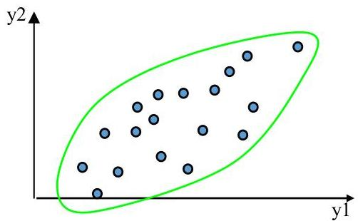
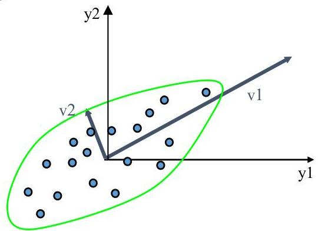

# Linear transformations

## Intuition:
- find the axis that shows the greatest variation
- project all points into this axis

## How:
- move origin to the center of the dataset
- find the eigenvectors and eigenvalues of the data covariance matrix
- the eigenvectors define the new data space

TÉCNICO+ FORMAÇÃO AVANÇADA