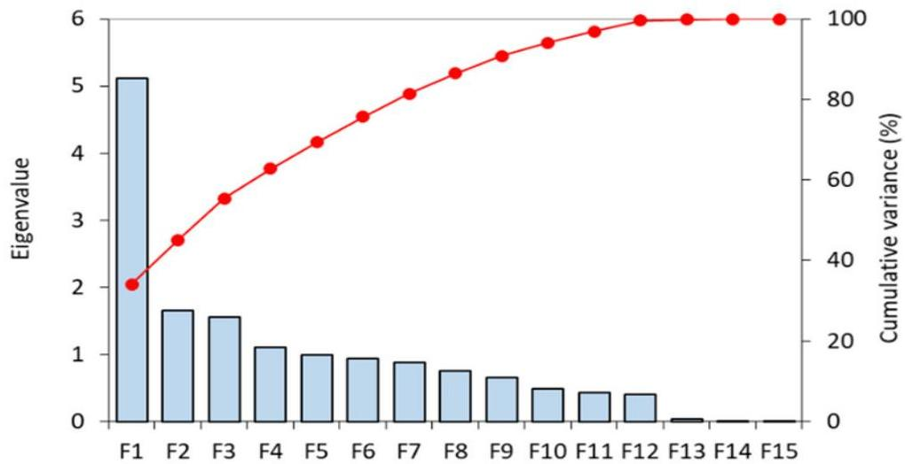

# Principal component analysis (PCA)

- PCA is SVD done on centered data
- singular vector/value = eigenvector/value
- First component (PC1): highest eigenvalue (direction with greatest variation)
- Second component (PC2): direction with maximum variation orthogonal to PC1

TÉCNICO+
FORMAÇÃO AVANÇADA