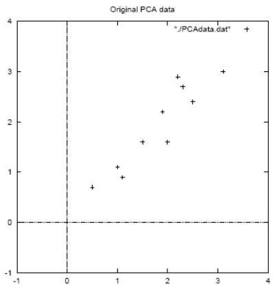

# Principal component analysis

- Revising how
1. Subtract mean of each variable
2. Compute the covariance matrix $m \times m$ (scatter of data)
3. Compute eigenvalues, $\lambda_1 \geq \lambda_2 \geq \ldots \geq \lambda_m$, and eigenvectors, $v_1, v_2, \ldots, v_m$
4. Keep the large $k$ eigenvalues ($k \leq m$) and construct the transformed space
5. Transform the dataset $D \to D'$

- Exercise: apply PCA on the following dataset

TÉCNICO+
FORMAÇÃO AVANÇADA