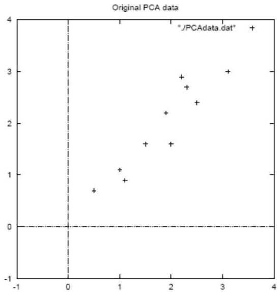

# PCA: Example

## 1. Centering data

|  y_{1} | y_{2}  |
| --- | --- |
|  2.5 | 2.4  |
|  0.5 | 0.7  |
|  2.2 | 2.9  |
|  1.9 | 2.2  |
|  3.1 | 3.0  |
|  2.3 | 2.7  |
|  2 | 1.6  |
|  1 | 1.1  |
|  1.5 | 1.6  |
|  1.1 | 0.9  |
|  mean 1.81 | 1.91  |
|  y_{1} | y_{2}  |
| --- | --- |
|  .69 | .49  |
|  -1.31 | -1.21  |
|  .39 | .99  |
|  .09 | .29  |
|  1.29 | 1.09  |
|  .49 | .79  |
|  .19 | -.31  |
|  -.81 | -.81  |
|  -.31 | -.31  |
|  -.71 | -1.01  |
|  mean 0 | 0  |

TÉCNICO+
FORMAÇÃO AVANÇADA