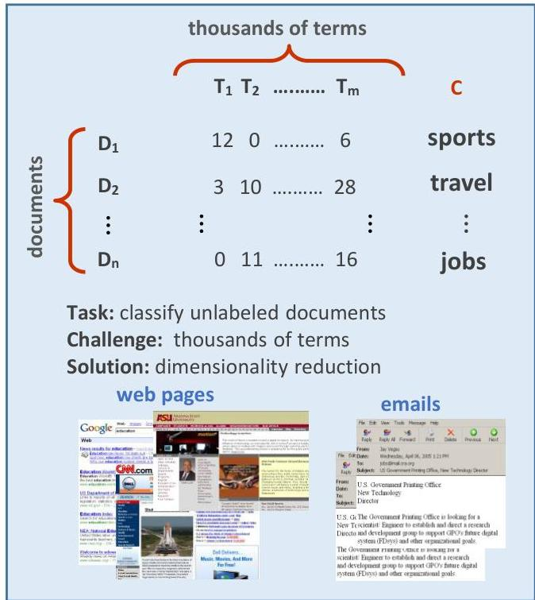

# Data domains with high-dimensionality

- text and web content data (left)
- social behavioral data
- biological data
- genetic variants (millions per individual)
- gene expression (&gt;20k genes)
- molecular concentrations (metabolites, proteins...)
- healthcare data (clinical records)
- consumer data
- signal, audio, image and video data

TÉCNICO+

FORMAÇÃO AVANÇADA