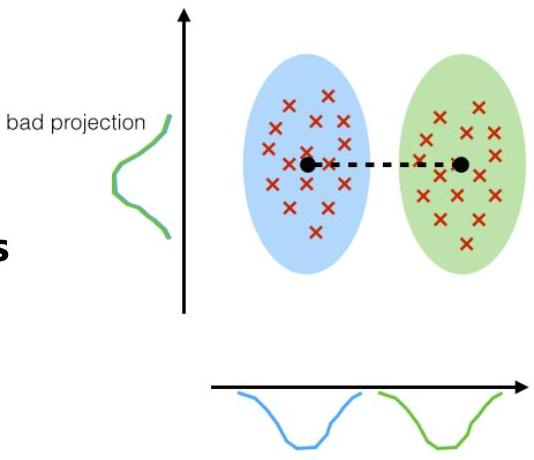

# Linear discriminant analysis (LDA)

- Challenges of PCA in supervised settings?
- Reduction does not consider impact on the ability to discriminate output variables
- Goal: data transformation guaranteeing class separation
- Principle: pick a new dimension that
- maximize separation between projected classes
- minimize variance of observations within each class
- Solution: LDA
- eigenvectors based on between-class and within-class covariance matrices

good projection: separates classes well

TÉCNICO+
FORMAÇÃO AVANÇADA