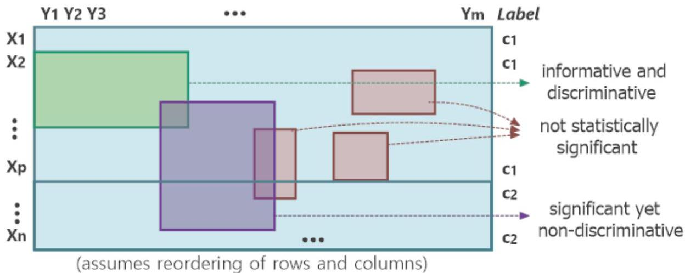

# Subspace selection

- Minimize overfitting: remove uninformative regions (focus on informative/discriminative patterns only)
- Minimize underfitting: mine all relevant regions

TÉCNICO+ FORMAÇÃO AVANÇADA