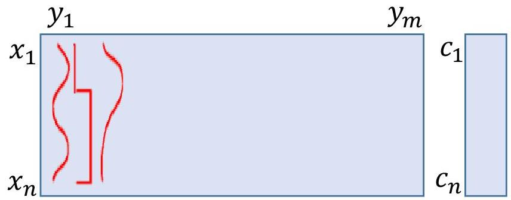
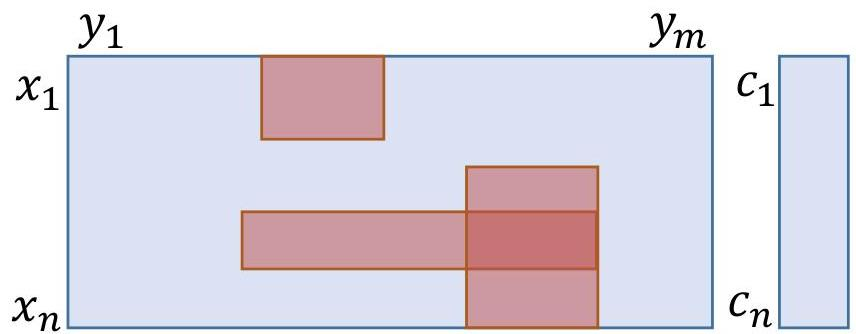

# Generalization: overfitting and underfitting risks

## Overfitting
- unability to discard non-informative and/or non-discriminative data

## Underfitting
- exclusion of informative or discriminative data from the learning

TÉCNICO+
FORMAÇÃO AVANÇADA