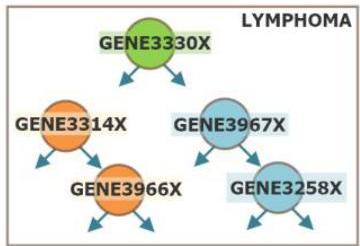

# Global and local learning

## "Global" learning

- descriptors (e.g., clusters) and predictors (e.g., discriminants)
- all features considered, often equally relevant in joint probabilistic stances (e.g. naïve Bayes)
- Problem? overfitting
- what if only a few variables are relevant?

## "Local" learning

- descriptors (patterns) and predictors (e.g. decision trees, kNN)
- few combined features or observations as long as they are informative or discriminative
- Problem? underfitting
- many potentially relevant features or observations neglected

TÉCNICO+
FORMAÇÃO AVANÇADA