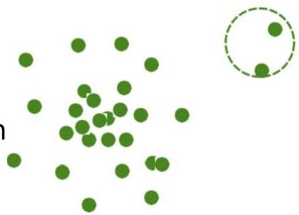

# Outlier analysis: statistical methods

- Statistical methods ≡ model-based methods (i.e. parametric)
- assume normal data follows some statistical distribution (stochastic model)
- observations not following the model seen as outliers
- example: Gaussian distribution to model normal data
- estimate probability of an observation fitting the distribution if low unlikely to be generated and thus an outlier
- Challenge: effectiveness depends on whether statistical assumption holds in real data

TÉCNICO+
FORMAÇÃO AVANÇADA