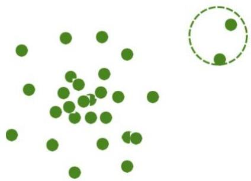

# Outlier analysis: proximity methods

- Observation is an outlier if nearest neighbors are far away
- proximity significantly deviates from the proximity of most observations
- Two major approaches: **distance-based** and **density-based**
- example: proximity of an object using 3 nearest neighbors
- **Challenge**: effectiveness highly depends on the distance metric
- in some applications, distances cannot be obtained easily
- difficulty in finding collective outliers

TÉCNICO+
FORMAÇÃO AVANÇADA