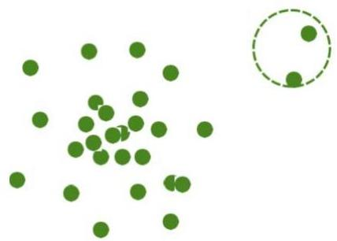

# Outlier analysis: clustering methods

- Principle
- normal data belong to large and dense clusters
- outliers belong to small or sparse clusters
- example: outliers form a tiny cluster (right)
- How? Clustering-based outlier detection methods
- many forms (e.g. DBSCAN)
- Challenge: clustering can be expensive

TÉCNICO+
FORMAÇÃO AVANÇADA