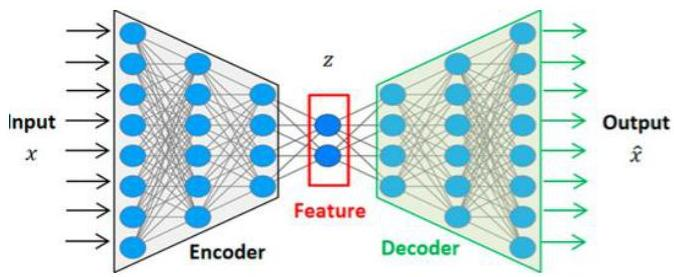

# Outlier analysis: deep learning methods

- Principle
- train an autoencoder using neural networks
- recall the aim: reconstruct an observation using a bottleneck architecture (relevant for denoising, representation... and detecting outliers!)
- normal observations should be easy reconstructed
- outlier observations have unexpected patterning and thus higher reconstruction error

- Challenge: high NN capacity can expressively model deviant behavior (low reconstruction error)

TÉCNICO+ FORMACÃO AVANÇADA