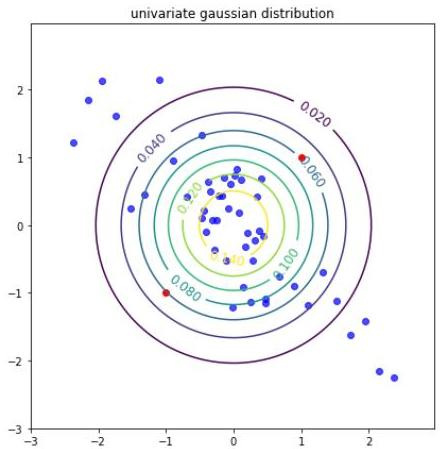
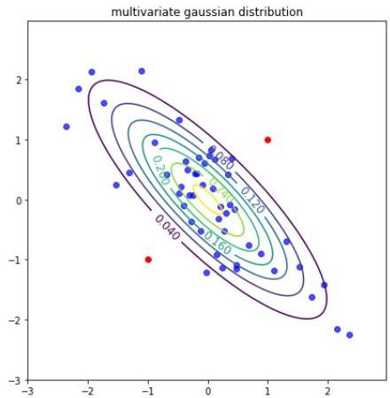

# Statistical-based detection (distribution-based)

- assumes that normal data is generated by a distribution with parameters $\theta$
- the probability density function $f(\mathbf{x}|\theta)$ gives the probability of observation $\mathbf{x}$ being generated by the distribution: the smaller, the more likely $\mathbf{x}$ is an outlier
- e.g. univariate outliers in $\{24.0, 28.9, 28.9, 29.0, 29.1, 29.1, 29.2, 29.2, 29.3, 29.4\}$ assuming $\mu + 3\sigma$?
- multivariate case?
- multivariate Gaussian
- naïve Bayes assumption

TÉCNICO+ FORMÁCÃO AVANÇADA