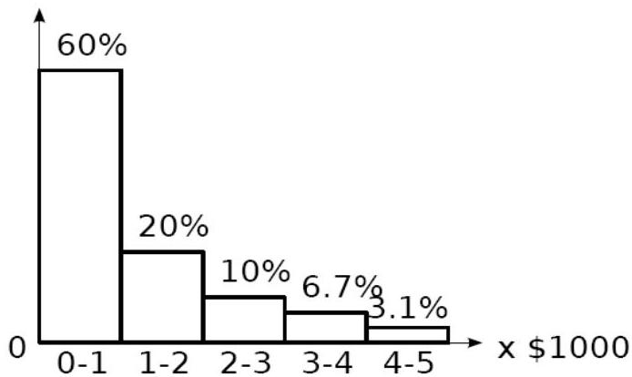

# Statistical-based detection (histogram-based)

- Model of normal data without a priori distribution
- example (figure)
- a transaction with amount $7,500 is an outlier, since only 0.2% transactions are &gt;$5,000

- Challenge: fix bin size
- too small → normal objects in rare bins, false positive
- too big → outliers in some frequent bins, false negative

Amount per transaction

TÉCNICO+
FORMAÇÃO AVANÇADA