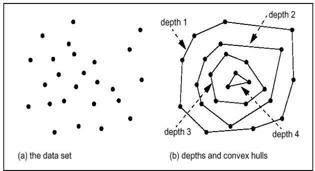

# Statistical-based detection (depth-based)

## How
- search for outliers at data borders
- observations in convex hull layers
- outliers are observations on outer layers

- Observations with depth ≤ k are outliers
- Basic assumption
- outliers are located at the border of the data space
- normal observations in the center of the data space

## Discussion
- similar to statistical approaches (k=1 distributions) but without a priori distribution
- convex hull computation is usually only efficient in small dimensional spaces (e.g. 3D)
- can be extended for outlier likelihood: depth as scoring value

TÉCNICO+
FORMAÇÃO AVANÇADA