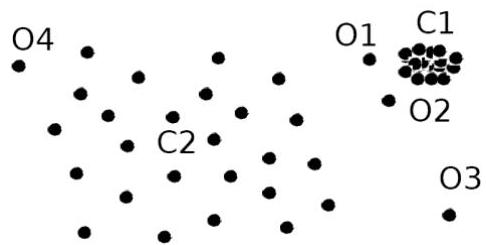

# Density-based approaches

- Local outliers: outliers comparing to their local neighborhoods, instead of the global data distribution
- $o_1$ and $o_2$ are local outliers to $C_1$
- $o_3$ is a global outlier, but $o_4$ is not an outlier
- distance-based clustering insufficient here

- Intuition (density-based outlier detection): the density around an outlier observation is significantly different from the density around its neighbors
- Method: use the relative density of an object against its neighbors
- $k$-distance: distance between observation and its $k$-th NN
- $k$-distance neighborhood: consider the distribution of distance to the $k$ neighbors

TÉCNICO+
FORMAÇÃO AVANÇADA