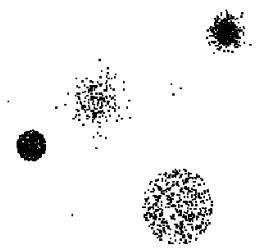
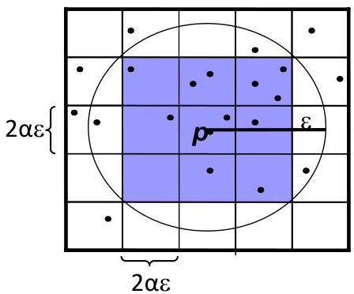

# Density-based approaches

Approaches essentially differ in how to estimate density
- density is simply measured by the inverse of the kNN distance
- examples
- local outlier factor (LOF)
- LOF ≈ 1: observation is in a cluster (homogeneous density around the point and its neighbors)
- LOF &gt;&gt; 1: point is an outlier
- connectivity-based outlier factor (COF)
- motivation: in regions of low density, it may be hard to detect outliers
- how: treat "low density" and "isolation" differently (take the ε-neighborhood instead of kNN)
- test multiple resolutions (varying ε)

TÉCNICO+ FORMAÇÃO AVANÇADA