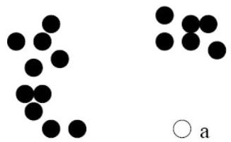
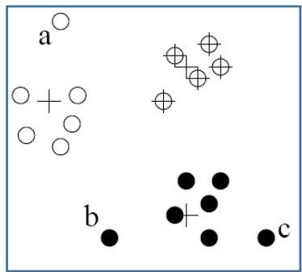

# Clustering approaches

- Observation is an outlier:
- not belong to any cluster
- density-based clustering method such as DBSCAN
- far from its closest cluster
- partitioning-based clustering such as k-means
- for each observation, assign an outlier score based on its distance from its closest center
- if dist/averageDist is large, likely an outlier
- belongs to a small or sparse cluster

TÉCNICO+

FORMAÇÃO AVANÇADA