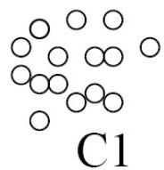

# Clustering approaches

- (cont.) small or sparse clusters
- FindCBLOF: find clusters, sort them in decreasing size, compute statistic to detect significantly size differences
- Pros and cons of clustering-based approaches
- strengths
- work for many types of data (clusters regarded as summaries)
- not requiring any labeled data
- efficiency in detecting outliers once the cluster are obtained
- weakness
- effectiveness highly depends on the clustering method
- clustering can be costly

TÉCNICO+

FORMAÇÃO AVANÇADA