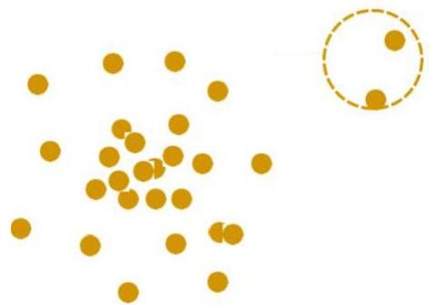

# Outlier analysis: applications

- Fraud detection: credit card, telecom, criminal activity in e-commerce
- Cybersecurity and intrusion detection (anti-viruses and network firewalls)
- Customized marketing: high/low income buying habits
- Healthcare: unusual responses to various drugs, rare diseases
- Analysis of performance statistics (e.g. professional athletes)
- Adverse weather and seismic prediction
- Financial applications: loan approval, stock tracking
- ...

TÉCNICO+
FORMAÇÃO AVANÇADA