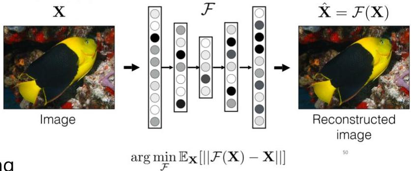

# Deep Learning approaches

Recall: autoencoders for reconstructing inputs, i.e. $\mathbf{x} \approx d(g(\mathbf{x}))$

- goal: learn the parameters of the encoder $g\colon X \to Z$ and decoder $d\colon Z \to X$ minimizing a reconstruction loss such as $\| \hat{\mathbf{x}} - \mathbf{x} \|^2$ where $\hat{\mathbf{x}} = d(g(\mathbf{x}))$
- premise: deviant behaviors are harder to reconstruct
- principle: reconstruction loss as a proxy for outlier likelihood

- Pros: inherent ability to handle complex data without an explicit data representation step
- dense, recurrent, convolutional, transformer-based layering for multivariate, temporal, spatial, text content

- Cons: expressivity needs to be controlled (e.g. ensuring compact bottleneck) to avoid high capacity to reconstruct outliers

TÉCNICO+
FORMAÇÃO AVANÇADA