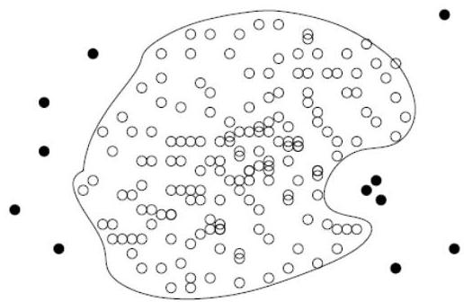

# Supervised approach: one-class model

- Idea: in the presence of labeled data, train a classification model that can distinguish "normal" data from outliers
- Problem: training set is typically heavily biased (normal observations far exceeds outliers)
- Possible solution: one-class model
- learn classifier to describe only the normal class.
- learn the decision boundary of the normal class (e.g. using SVM)
- observations that do not belong to the normal class (not within the decision boundary) declared as outliers
- Advantage: detect new outliers that may not appear close to any outlier in training data
- Extension: Normal objects may belong to multiple classes

TÉCNICO+ FORMACÃO AVANÇADA