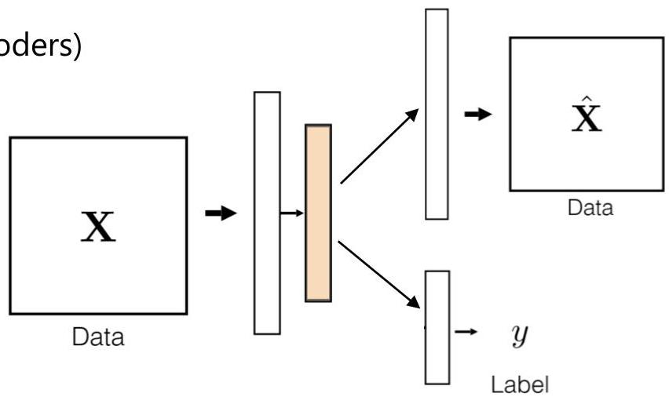

# Supervised approach: multi-task learning

## Hybrid neural networks

- combining supervision and unsupervision (autoencoders)
- single encoder
- two decoders
- dedicated path for the supervised outlier detection task, other for reconstruction
- parameters of decoders updated simultaneously or alternatively
- going beyond two dedicate paths... exploring synergies with other (un)supervised tasks

TÉCNICO+
FORMAÇÃO AVANÇADA