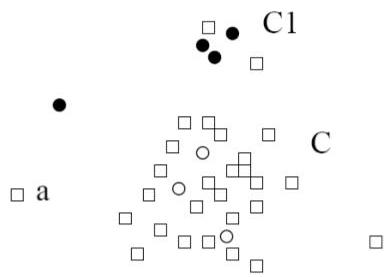

# Semi-supervised approaches

## How

- semi-supervised classification (e.g. pseudo-labeling)
- semi-supervised clustering (e.g. membership constraints)
- any object that does not fall into the model for $C$ (such as $a$) is considered an outlier as well

## Pros and cons

- strengths: efficient, effective
- bottlenecks:
- quality heavily depends on the availability and quality of train data
- difficult to obtain representative and high-quality training data

- objects with label "normal"
- objects with label "outlier"
- objects without label

TÉCNICO+ FORMACÃO AVANÇADA