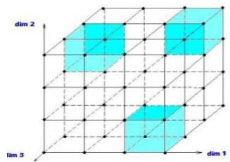
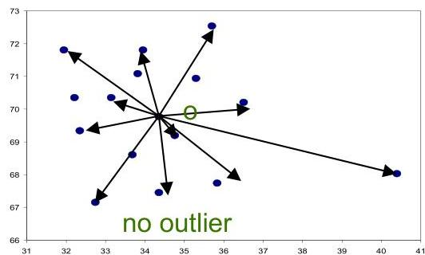

# Outlier analysis in high-dimensional data

- HilOut: distance-based detection, yet uses ranks instead of absolute distances
- subspaces: find outliers in multiple lower dimensional subspaces: easy to interpret
- ABOD: angle-based outlier degree
- angles are more stable than distances in high dimensional spaces
- observation is outlier if most others are located in similar directions

TÉCNICO+

FORMAÇÃO AVANÇADA