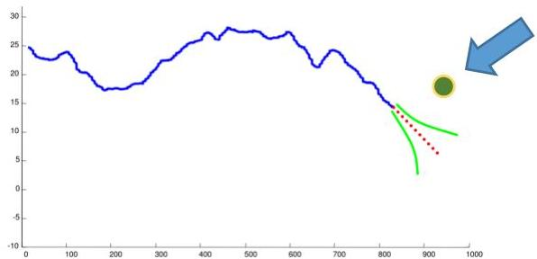

# Outlier analysis on temporal data

Simple extension of traditional outlier detection techniques:

- learn good representations of time series data and apply previous techniques
- apply time series clustering and remove
- observations untagged by density-based clustering approaches
- observations belonging to very small clusters or clusters with loose silhouette
- model time series distributions (centroid or class-conditional "prototype" time series) and test expectations (how well a time series is described by the distribution)

Please note that novelty detection in a single time series (left image) differs from novelty detection in time series data (above)

TÉCNICO+
FORMAÇÃO AVANÇADA