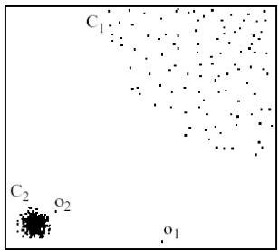

# What is an outlier?

- Outlier $\equiv$ anomaly $\equiv$ exception $\approx$ novelty
- outlier analysis $\equiv$ deviant behavior analysis $\equiv$ anomaly analysis $\equiv$ exception analysis $\approx$ novelty analysis

- Outlier: observation that deviates significantly from the normal observations as if it was generated by a different mechanism
- e.g. unusual credit card purchase, Michael Jordon...
- global outlier: observations inconsistent with rest of the dataset
- local outlier: observations inconsistent with their neighborhoods

- Outliers differ from noise data
- noise is random error or variance in the measured variables
- outlier analysis should be able to discard noise

TÉCNICO+
FORMAÇÃO AVANÇADA